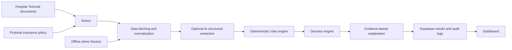

# Surgical Pre-Authorization AI Agent

The current interface is the PreAuth operations workspace: a compact enterprise dashboard with a charcoal navigation rail, Inter typography, semantic status badges, review queue, audit logs, integrations, settings, responsive tables, and accessible loading/error states.

Security details, deployment requirements, and known limitations are documented in [SECURITY.md](./SECURITY.md).

A functional administrative pre-authorization prototype, presented as **Clarity**. Built for a hackathon with exclusively fictional records.

## Problem

Hospital requests and insurance conditions arrive in different formats. Initial administrative checks are slow, difficult to trace, and often interrupted by missing documentation.

## Solution

A deterministic rules engine evaluates policy eligibility, exact procedure codes, exclusions, calendar-day waiting periods, document presence, and data consistency. An optional AI adapter interprets unstructured text; it cannot approve a case or replace policy conditions.

## Demo

Run `npm install`, then `npm run dev`, and open http://localhost:3000. No credentials are needed. Open **Run Demo Case**, select a case, and run analysis. Results are generated through `POST /api/analyze`, never pre-populated or fabricated. Use **View case** for the rule evidence and timestamped timeline. Case 5 appears in **Human review** after analysis.

Publication status: prepared for GitHub and Vercel; public URLs are added only after deployment is verified.

## Architecture



## Technology Stack

Next.js App Router, TypeScript strict mode, React, Tailwind CSS, Zod, Vitest, Notion REST API, Supabase PostgreSQL REST API, and Vercel. Native fetch keeps the provider adapters lightweight.

## Structure

```
app/                 Dashboard, case detail, review queue, API routes
components/          Interactive dashboard and case detail
lib/ai/              Provider interface, prompts, schemas, interpretation
lib/notion/          Database discovery, pagination, validated records
lib/rules/           Six independent deterministic checks
lib/decision/        Explicit decision precedence
lib/security/        Sanitization and basic rate limiting
lib/supabase/        Server-only persistence
lib/audit/           Timestamped audit events
lib/types.ts         Strict domain models
lib/schemas.ts       Runtime input and source validation
data/demo/           Five fictional cases
supabase/migrations/ Database schema and transactional persistence RPC
scripts/             Idempotent fictional Notion seeder
tests/               Domain, AI boundary, provider and API tests
```

## Workflow

1. Validate the request ID with Zod.
2. Fetch the request, patient and policy from fixtures or Notion.
3. Validate and normalize structured records. Reject invalid source schemas; missing/invalid policies become a human-review result.
4. When unstructured text exists, extract facts with the single configured provider.
5. Check evidence and contradictions against the structured record. AI cannot fill missing contractual facts.
6. Execute all six rules without stopping at the first failure.
7. Determine the decision and generate its explanation from rule reasons.
8. Optionally mirror the result to Notion; record a sync failure if that write fails.
9. Persist the result and complete audit timeline atomically in Supabase, then return JSON.

Processing duration uses `performance.now()` from analysis entry to the persistence boundary, including fetching, interpretation, rules and optional Notion synchronization. It excludes the final database write and network delivery; it is never hardcoded. UI formatting uses seconds with three decimals.

## AI Architecture

`AIProvider` exposes `extractMedicalRequest`, `extractPolicyInformation`, and `generateExplanation`. Configure exactly one of `openai`, `gemini`, `groq`, or `openrouter` through `AI_PROVIDER`, and supply `AI_MODEL` plus that provider's key. No automatic provider fallback or undisclosed data forwarding occurs.

Adapters use each provider's OpenAI-compatible Chat Completions endpoint with JSON mode. Every response is validated with strict Zod schemas. Choose a model supporting JSON mode. Missing configuration, malformed JSON, provider errors, ambiguous extraction, unsupported evidence, and conflicting facts result in human review when interpretation is needed.

Extracted values must have verbatim evidence and match authoritative structured records. This MVP deliberately treats extraction as corroboration and uncertainty detection: it does not automatically promote text-only policy terms into authoritative coverage rules. The explanation method selects existing rule references; user-facing explanations are rendered from deterministic code, avoiding unverified generated claims.

The default demo does not call an LLM because its records are structured. To demonstrate AI, add `unstructuredText` to a fictional request or policy payload in Notion, configure a provider, and re-run the case. For example: `Requested procedure code DEMO-001`. Conflicting text must produce review.

Official references: [OpenAI JSON outputs](https://developers.openai.com/api/docs/guides/structured-outputs), [Gemini compatibility](https://ai.google.dev/gemini-api/docs/openai), [Groq compatibility](https://console.groq.com/docs/openai), [OpenRouter API](https://openrouter.ai/docs/api/reference/overview).

## Rules Engine

Each rule returns `{ passed, code, reason, evidence? }`. Decision precedence:

1. Missing/conflicting critical data or an inactive/out-of-date policy: `HUMAN_REVIEW_REQUIRED`.
2. Explicit exclusion or procedure code absent from the explicit coverage list: `NOT_COVERED`.
3. Uncompleted waiting period: `WAITING_PERIOD_NOT_COMPLETED`.
4. Missing/invalid required document: `DOCUMENTS_REQUIRED`.
5. Every check passes: `PRE_APPROVED`.

Coverage is an exact synthetic procedure-code match. Covered and excluded lists that overlap are contradictory and require review. Dates are validated as real ISO calendar dates and compared in UTC; waiting periods are inclusive at the required-day boundary. January 1 to September 20, 2026 is 262 days. Empty lists explicitly mean no entries; absent lists are invalid. Document checks verify inventory status, not authenticity or clinical adequacy.

`confidence` is a binary completeness indicator (1 for complete consistent critical inputs, 0 otherwise), not a model probability, clinical confidence or calibrated risk score. All rule factors remain visible regardless of the final decision.

## Notion Integration

Use `DATA_SOURCE=notion`. Create four databases with exactly one data source each; connect each database to your Notion integration. Supported API version: `2025-09-03`. The adapter resolves a database ID to its data source and paginates queries, following the [official migration guide](https://developers.notion.com/guides/get-started/upgrade-guide-2025-09-03).

| Database | Properties                                                                                             |
| -------- | ------------------------------------------------------------------------------------------------------ |
| Patients | `ID` (Title), `Payload` (Rich text containing Patient JSON)                                            |
| Policies | `ID` (Title), `Payload` (Rich text containing Policy JSON)                                             |
| Requests | `ID` (Title), `Payload` (Rich text containing SurgicalRequest JSON), `Status` (Select, with `Pending`) |
| Results  | `ID` (Title), `Payload` (Rich text containing result summary JSON)                                     |

Payloads use the exact fields in `lib/types.ts` and `lib/schemas.ts`; join request.patientId to patient.id and patient.policyNumber to policy.id. Invalid or ambiguous duplicate IDs fail explicitly. A missing/invalid policy routes to human review. Malformed request/patient payloads return a safe ingestion error and must be repaired before analysis.

Set the five `NOTION_*` environment variables, then run `npm run seed:notion` with Node 24. This creates only fictional records, skips existing IDs, and never overwrites existing rows. Environment variables must already be exported in your shell, or use `node --env-file=.env.local scripts/seed-notion.mjs` with a user-managed, ignored local file. The application does not create secret files.

Requests remain Pending so they can be re-analyzed during the demonstration. Notion results are append-only summaries; Supabase holds the latest complete result and all audit runs. Notion synchronization is best effort and its failure appears in the timeline.

## Database

Execute `supabase/migrations/001_initial.sql` in your Supabase SQL editor. Set server-side `SUPABASE_URL` and `SUPABASE_SERVICE_ROLE_KEY`. Result and audit writes use one PostgreSQL transaction. RLS is enabled, no anonymous policies are created, and the persistence RPC is restricted to the service role.

`application_users` links to Supabase Auth for a future individual-user workflow; this MVP uses administrative Basic Auth for the integrated environment. Supabase is required in Notion mode. In demo mode without Supabase, results use process memory: they can reset on restarts or serverless cold starts and are not shared across instances. Configure Supabase for a durable multi-instance demonstration.

## Security

Zod validation, strict response schemas, size limits, server-only imports, environment-based secrets, safe errors, same-origin mutation checks, React text escaping, security headers, and a bounded in-memory rate limiter are included. No `dangerouslySetInnerHTML` is used. Source URLs are never fetched by the model or server.

Notion mode requires `ADMIN_PASSWORD`; both pages and APIs require HTTP Basic Auth with username `admin`. Always deploy behind HTTPS. The fictional offline demo is intentionally public. The global rate limiter allows 30 analyses per minute per process and is a basic prototype defense; production requires a shared limiter/WAF. CSP currently allows inline scripts/styles for Next.js; production hardening should use per-request nonces.

Document text is untrusted. The system prompt explicitly forbids following embedded instructions. Suspicious instructions are flagged before provider calls. Regex detection is an additional signal, not a complete injection defense; schema validation, evidence checks, and the rule engine remain the enforcement boundaries. Logs contain event names and minimal check metadata, not API keys or raw documents.

## Privacy

Use fictional data exclusively. Do not put real medical records into this prototype. Optional AI calls transmit supplied fictional document text to the one configured provider. No document upload, real patient enrollment, clinical approval, or treatment recommendation is implemented.

## Installation

Node.js 24 and npm are required.

```sh
npm ci
npm run dev
```

## Environment Variables

See `.env.example`. The offline demo works with no environment file.

| Variable                                                                                                                  | Purpose                                                    |
| ------------------------------------------------------------------------------------------------------------------------- | ---------------------------------------------------------- |
| `DATA_SOURCE`                                                                                                             | `demo` (default) or `notion`                               |
| `AI_PROVIDER`                                                                                                             | `none` (default), `openai`, `gemini`, `groq`, `openrouter` |
| `AI_MODEL`                                                                                                                | Explicit JSON-capable model ID                             |
| `OPENAI_API_KEY`, `GEMINI_API_KEY`, `GROQ_API_KEY`, `OPENROUTER_API_KEY`                                                  | Only the selected key is used                              |
| `NOTION_API_KEY`                                                                                                          | Server-side Notion integration secret                      |
| `NOTION_PATIENTS_DATABASE_ID`, `NOTION_POLICIES_DATABASE_ID`, `NOTION_REQUESTS_DATABASE_ID`, `NOTION_RESULTS_DATABASE_ID` | Four database IDs                                          |
| `SUPABASE_URL`, `SUPABASE_SERVICE_ROLE_KEY`                                                                               | Durable server-side persistence                            |
| `ADMIN_PASSWORD`                                                                                                          | Required in Notion mode; username `admin`                  |

Never use `NEXT_PUBLIC_` for secrets. `.env*` files are ignored except `.env.example`.

## Local Development

`npm run dev` starts the application. `npm run build` and `npm start` run production locally. Routes: `/dashboard`, `/requests/REQ-001`, `/review`, `GET /api/requests`, `POST /api/analyze`.

```sh
curl -X POST http://localhost:3000/api/analyze -H "Content-Type: application/json" -d '{"requestId":"REQ-001"}'
```

## Testing

```sh
npm run typecheck
npm test
npm run lint
npm run build
```

Tests cover the five expected outcomes, inactive/expired policies, invalid dates, exact waiting boundaries, missing terms, injection, malformed AI output, conflicting policy rules, evidence validation, provider endpoint selection, and complete API analysis/persistence. Provider tests mock external responses; live integrations require credentials and are not represented as verified by mock tests. GitHub Actions runs all checks on push and pull request.

## Deployment

1. Publish this directory as a public GitHub repository (intended owner: `abdiellzz`). Verify `.env.example` is the only tracked environment file.
2. Import the repository into Vercel. Framework: Next.js; root: repository root; Node: 24; build: `npm run build`.
3. For an immediate fictional demo, set `DATA_SOURCE=demo` and `AI_PROVIDER=none`; no paid API is needed.
4. For durable results, apply the SQL migration and set Supabase variables in Vercel.
5. For Notion/AI, configure their variables and `ADMIN_PASSWORD`, then redeploy.
6. Verify all five cases, detail pages, review queue, and security headers at the public URL.

No provider credentials are needed at build time. Vercel's route duration is set to 120 seconds; your account plan must support that duration for the optional external calls.

## Demo Cases

| Case    | Fictional procedure                                 | Expected result              |
| ------- | --------------------------------------------------- | ---------------------------- |
| REQ-001 | Knee Arthroscopy                                    | PRE_APPROVED                 |
| REQ-002 | Appendectomy; missing pre-operative laboratory      | DOCUMENTS_REQUIRED           |
| REQ-003 | Elective Bariatric Surgery; policy started August 1 | WAITING_PERIOD_NOT_COMPLETED |
| REQ-004 | Cosmetic Rhinoplasty; explicit exclusion            | NOT_COVERED                  |
| REQ-005 | Shoulder Arthroscopy; both covered and excluded     | HUMAN_REVIEW_REQUIRED        |

## Limitations

This is administrative hackathon software, not a regulated production system. It has no clinical decision workflow, real procedure-code taxonomy, document authenticity checks, OCR, organization tenancy, individual-user authorization, distributed rate limiting, or automatic coverage interpretation from text alone. Default demo persistence is temporary. Live Notion, Supabase and AI calls need account configuration and a separate verification run. Failed Notion mirrors are logged but not retried automatically.

## Future Improvements

Individual Supabase Auth sessions, tenant isolation, distributed limits, versioned policy provenance, reviewed text extraction, OCR with source-page evidence, durable job queues, Notion synchronization retries, and calibrated evaluation datasets.

## Disclaimer

All patients, hospitals, clinicians, insurers, procedures and policy terms in the fixtures are fictitious. This system supports initial administrative review only. It does not diagnose, recommend treatments, replace clinicians, grant clinical approval, or guarantee insurance payment.
